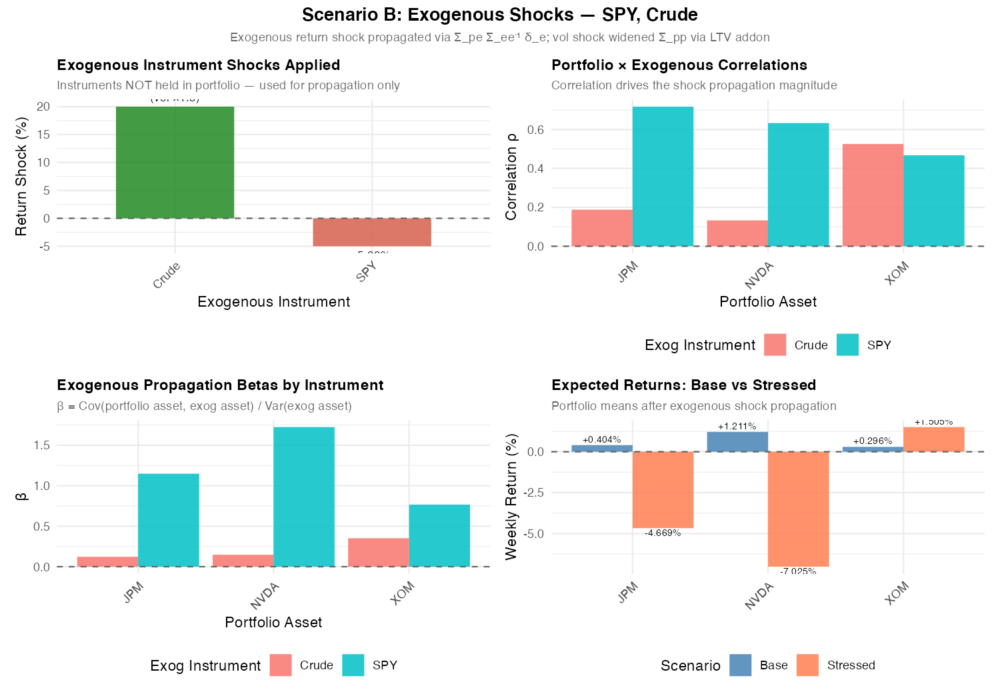
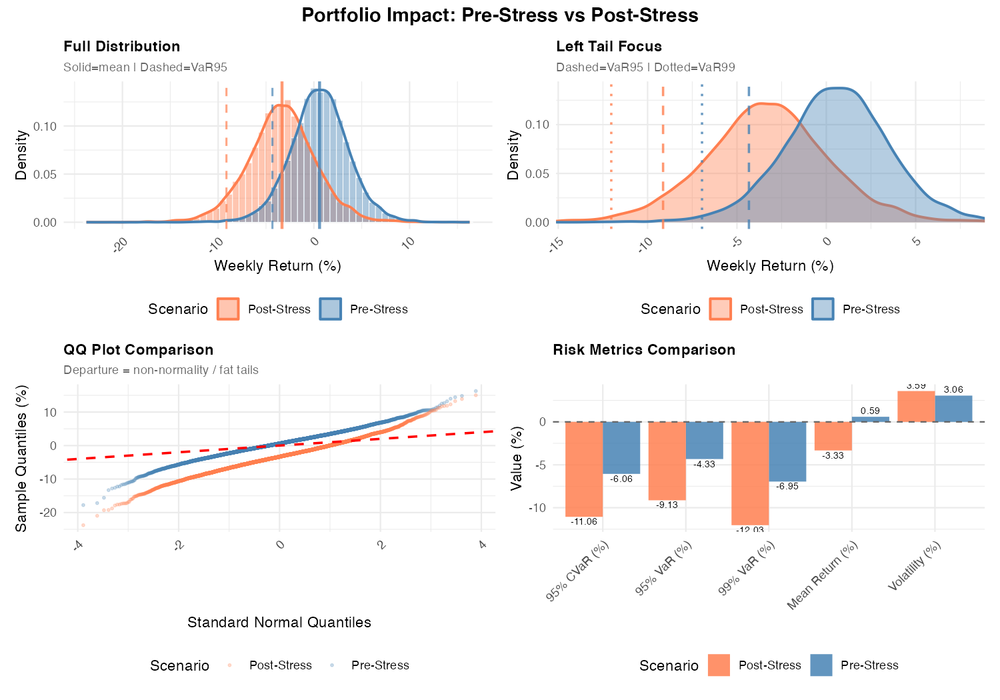

<!-- README.md is generated from README.Rmd. Please edit that file -->

```{r, include = FALSE}
knitr::opts_chunk$set(
  collapse = TRUE,
  comment = "#>",
  fig.path = "man/figures/README-",
  out.width = "100%"
)
```

# Package mcst: Overview

<!-- badges: start -->
<!-- badges: end -->

**mcst** (Monte Carlo & Stress Testing) is an R package that provides end-to-end, easily specifiable workflows for portfolio return simulation, risk assessment, and stress testing. It enables users to model shocks from both endogenous (portfolio-driven) and exogenous (market-driven) sources. The package offers a flexible framework for asset return modeling using multiple distribution families, copula-based dependence structures, and forward-looking covariance estimation.
## Installation

You can install the development version of mcst from [GitHub](https://github.com/) with `remotes::install_github("calebong/mcst", dependencies = TRUE)`.

More information on the package can be found via the function mechanics [Introduction to the mcst package](https://github.com/calebong/mcst/blob/main/inst/doc/portfolio_risk_simulation_vignette.pdf) and usage illustration [Sample Scenario Illustrations](https://github.com/calebong/mcst/blob/main/inst/doc/portfolio_risk_simulation_scenarios.pdf) documentations.

``` r
# install.packages("devtools")
devtools::install_github("calebong/mcst")
```


```{r load data, include=FALSE}
library(tidyverse)
library(ggplot2)
load( "/Users/Caleb/Documents/Working Directory/mcst/data/returns_data.RData")
load( "/Users/Caleb/Documents/Working Directory/mcst/data/exo_data.RData")

returns_data=returns_data %>% select(week, NVDA, JPM, XOM)
```

## Example

The illustration uses a sample portfolio of 3 equal-weighted stocks (endogenous factors) and 2 market-wide, exogenous factors - SPY and Crude Oil - as shocks. Weekly returns from 2016 to ~2026 are used.

```{r pressure, echo = TRUE}
head(returns_data)
head(exo_data)

tail(returns_data)
tail(exo_data)
```

Illustration of a stagflationary-like stress scenario: energy costs surge while equity markets sell off simultaneously. Options are provided to specify whether the shock is endogenous and/or exogenous, and whether the shock is applied on to returns and/or volatility. The following scenario spceifies a stagflationary shock of -5% and +20% to expected returns of SPY and Crude respectively, and that SPY and Crude volatility increases by a factor of 1.1x and 1.5x respectively. 

```{r s1, echo = TRUE, results = 'hide', message = FALSE, warning = FALSE}
library(mcst)

exogenous_shock            <- list(SPY = -0.05, Crude = 0.20) # stagflationary-like shock; -5% to SPY, +20% to crude oil
exogenous_volatility_shock <- list(SPY = 1.1,   Crude = 1.5) # SPY and Crude volatility increase

# Basic simulation with equal weights
result_stag <- portfolio_risk_simulation(
  historical_returns          = returns_data,
  sim_returns_dist            = "rmvt",
  cov_estimation              = "garch",
  calibrate_params            = TRUE,
  calibration_method          = "full",
  copula                      = TRUE,
  copula_type                 = "t",
  copula_df                   = 4,
  n_sim_returns               = NULL,
  propagation                 = TRUE,
  exogenous_returns           = exo_data,
  exogenous_shock             = exogenous_shock,
  exogenous_volatility_shock  = exogenous_volatility_shock,
  df                          = 4,
  seed                        = 123
)
```


```{r show stagflation, echo = FALSE, results = 'hide'}
# Save plot to file
result_stag_portfolio_distribution_comparison <- result_stag$stressed_plots$portfolio_distribution_comparison
result_stag_exogenous_propagation <- result_stag$stressed_plots$exogenous_propagation
```

```{r save stagflation, include=FALSE}
# Save plot to file
ggsave("man/figures/result_stag_portfolio_distribution_comparison.png", result_stag_portfolio_distribution_comparison, width = 10, height = 7, dpi = 150)

```

# Example Analysis

Assets with high SPY correlation (JPM, NVDA) absorb the largest mean shift from the SPY leg, contributing to negative expected portfolio returns; XOM’s positive Crude correlation and beta provides a partial positive return offset to expected portfolio returns.





